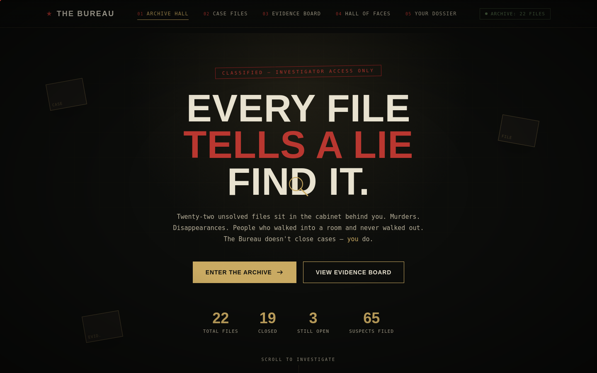

# The Bureau

A premium, noir-themed detective mystery website. Review evidence, interrogate suspects, and file your verdict across 22 original case files — 19 closed, 3 still open.



**[Live demo →](#)** _(replace with your GitHub Pages URL once deployed — see below)_

## Features

- **22 original mystery cases** — murders and missing-person files, each with a briefing, suspects, motives, alibis, and physical evidence
- **Verdict system** — accuse a suspect, get an instant correct/incorrect ruling with the Bureau's full reasoning and a twist; open cases are honestly marked "unconfirmed" instead of being scored
- **Evidence corkboard** — every closed case pinned to one wall, connected with red string
- **Hall of Faces** — a draggable 3D gallery of all 65 suspects ever filed
- **Personal dossier** — tracks cases viewed, verdicts filed, and accuracy
- **Case Reconstruction comics** — illustrated noir-comic panels reconstructing key scenes (currently on Case 001, "The Velvet Curtain," as a demo of the format)
- Custom magnifying-glass cursor, pixel-tile page transitions, full mobile responsiveness
- **Zero build step.** Vanilla HTML/CSS/JS — no npm install, no bundler, no dependencies


## Project structure

```
the-bureau/
├── index.html         Page structure, routing markup, all view sections
├── styles.css          Full noir design system (colors, type, layout, animations)
├── app.js              Application logic — routing, rendering, state, interactions
├── cases-data.js        22 case files: suspects, evidence, solutions, twists
├── comics-data.js      Illustrated SVG case-reconstruction panels (currently case 001)
└── docs/
    └── screenshot-home.png
```

No build tooling, no `package.json`, no bundler config — every file is loaded directly by `index.html` via `<script src="...">` tags.

## Deploying to GitHub Pages

1. Push this repo to GitHub.
2. Go to **Settings → Pages**.
3. Under **Source**, select the `main` branch and `/ (root)` folder.
4. Save. Your site will be live at `https://<your-username>.github.io/the-bureau/` within a minute or two.

No build step means no GitHub Actions workflow is needed — Pages serves the static files as-is.

## Adding a new case

Open `cases-data.js` and append an object to the `CASES` array:

```js
{
  id: "023",
  code: "C-1290",
  title: "Your Case Title",
  type: "murder",        // or "missing"
  status: "closed",      // or "open" — open cases must have no guilty:true suspect
  difficulty: "moderate", // "easy" | "moderate" | "hard"
  victim: "...",
  location: "...",
  date: "...",
  teaser: "...",
  briefing: "...",
  suspects: [
    { name: "...", role: "...", motive: "...", alibi: "...", guilty: false },
    // exactly one suspect should have guilty: true if status is "closed"
  ],
  evidence: [
    { name: "...", detail: "..." }
  ],
  solution: "...",
  twist: "..."
}
```

The home page stats, evidence board, and Hall of Faces all read from this array automatically — no other file needs to change.

## Adding a comic reconstruction to a case

Comics are keyed by case `id` in `comics-data.js`:

```js
const CASE_COMICS = {
  "001": `<svg viewBox="0 0 1000 760" ...>...</svg>`,
  "002": `<svg viewBox="0 0 1000 760" ...>...</svg>`,
};
```

Each entry is a raw SVG string (no external image files). `app.js` checks `CASE_COMICS[caseId]` when rendering a case detail page and only shows the "Case Reconstruction" section if an entry exists — cases without art are unaffected.

## License

MIT — see [LICENSE](LICENSE).

All case names, characters, and crimes are fictional.
